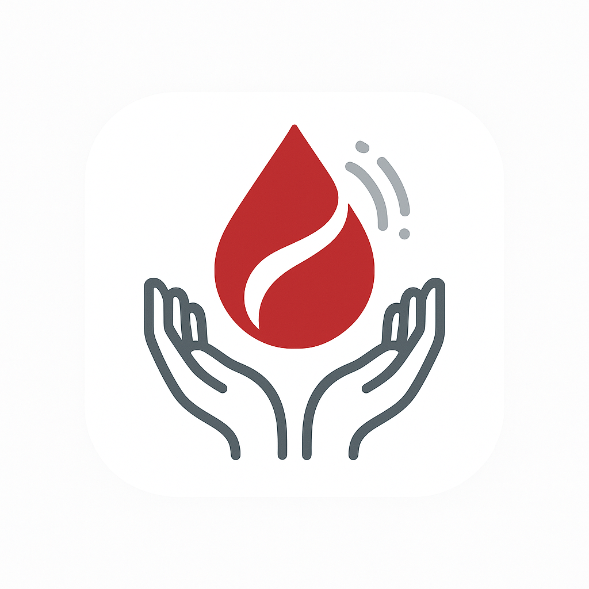

# 🩸 Blood Donation App

<p align="center">
  
</p>

<p align="center">
  <strong>A comprehensive, multi-role blood donation management system built with Flutter & Firebase</strong>
</p>

<p align="center">
  <a href="#features">Features</a> •
  <a href="#tech-stack">Tech Stack</a> •
  <a href="#architecture">Architecture</a> •
  <a href="#getting-started">Getting Started</a> •
  <a href="#project-structure">Project Structure</a> •
  <a href="#user-roles">User Roles</a> •
  <a href="#screenshots">Screenshots</a>
</p>

---

## 📖 Overview

**Blood Donation App** is a production-ready, cross-platform mobile application that connects blood donors, recipients, hospitals, blood banks, and administrators in a unified ecosystem. The app streamlines the entire blood donation lifecycle — from creating urgent blood requests to matching compatible donors based on blood type and real-time geolocation, all powered by intelligent notifications and in-app chat.

---

## ✨ Features

### 🔐 Authentication & User Management
- **Multi-role authentication** — Separate sign-up and login flows for 5 user types: Donor, Recipient, Hospital, Blood Bank, and Admin
- **Firebase Authentication** with email/password
- **Google Sign-In** integration for quick onboarding
- **Profile completion flows** — Dedicated onboarding screens for each user role to collect role-specific information
- **Role-based routing** — Automatic redirection to the appropriate dashboard based on user role after login

### 🩸 Blood Request Management
- **Create blood requests** — Recipients and hospitals can create requests specifying blood type, units needed, urgency level, and location
- **Urgency levels** — Support for Emergency, Urgent, Normal, and Low priority requests with color-coded visual indicators
- **Request lifecycle** — Full status tracking: Pending → Active → Accepted → Completed / Expired / Cancelled
- **Auto-expiry** — Cloud Functions automatically expire stale requests every 5 minutes
- **Countdown timers** — Beautiful animated circular countdown timers on active requests showing remaining time

### 🔍 Smart Donor Matching
- **Blood type compatibility matching** — Full ABO/Rh compatibility matrix (e.g., O- universal donor, AB+ universal recipient)
- **Priority-based matching** — Exact match > Same ABO type > Universal donor scoring system
- **Geolocation-based filtering** — Only match donors within a configurable search radius using the Haversine formula
- **Real-time availability** — Only matches donors who are marked as available

### 🗺️ Location & Maps
- **OpenStreetMap integration** — Free map rendering using `flutter_map` (no Google Maps API key required)
- **Real-time geolocation** — Get current user location with `geolocator`
- **Geocoding** — Convert coordinates to human-readable addresses and vice versa
- **Location permissions** — Graceful handling of location permission requests

### 🔔 Notifications System
- **Firebase Cloud Messaging (FCM)** — Push notifications via FCM HTTP v1 API with OAuth2 authentication
- **In-app notification inbox** — Real-time Firestore-backed notification system with unread tracking
- **Smart notification targeting** — Notifications sent only to compatible donors/blood banks within range
- **Notification types:**
  - 🩸 New blood request alerts (donors & blood banks)
  - ✅ Request acceptance confirmations (recipients)
  - 💬 Chat message notifications
  - 🏥 Fulfillment reminders (blood banks)
  - 👤 Profile update alerts (admins)
  - ✔️ Account approval notifications (institutions)
- **Cloud Functions triggers** — Automatic notification dispatch on request creation and acceptance
- **Notification queue** — Reliable delivery with a Firestore-based queue processed by Cloud Functions
- **Daily cleanup** — Scheduled Cloud Function to purge old processed notifications every 24 hours

### 💬 Real-Time Chat
- **In-app messaging** — Real-time chat between donors and recipients after request acceptance
- **Chat threads** — Organized conversation threads per blood request
- **Stream-based updates** — Live message streaming using Firestore snapshots
- **Chat navigation** — Deep-link from notifications directly into chat conversations

### 🏥 Blood Bank Management
- **Inventory management** — Track blood stock levels per blood type with add/remove operations
- **Stock screen** — Dedicated inventory dashboard for blood bank operators
- **Fulfillment service** — Post-acceptance workflow with scheduled reminders and automatic inventory deduction
- **Pending fulfillments** — Persistent tracking of accepted-but-not-yet-fulfilled requests

### 🏥 Hospital Features
- **Hospital blood requests** — Hospitals can create blood requests on behalf of patients
- **My requests tracking** — View and manage all hospital-initiated blood requests
- **Profile completion** — Hospital-specific onboarding with institutional details

### 👨‍💼 Admin Panel
- **Admin dashboard** — Central management console for the entire platform
- **User verification** — Review and approve blood bank and hospital accounts
- **User management** — View and manage all users across all roles
- **Admin management** — Manage other admin accounts
- **Reports & analytics** — Platform-wide reporting with charts powered by Syncfusion Flutter Charts
- **Profile management** — Admin profile viewing and editing

### 🎨 UI/UX
- **Modern Material Design** — Clean, soft-themed UI with custom `BloodAppTheme`
- **Gradient cards** — Beautiful blood request cards with status-based gradient backgrounds
- **Custom snackbar system** — Top-sliding animated snackbars for success, error, warning, info, and blood request notifications
- **Blood type color coding** — Each blood type gets a unique color for instant visual identification
- **Urgency indicators** — Color-coded urgency badges (Emergency: Coral, Urgent: Orange, Normal: Blue, Low: Green)
- **Responsive design** — Adaptive layouts for various screen sizes

### 🔒 Security
- **Firestore Security Rules** — Comprehensive rules enforcing:
  - Users can only read/write their own documents
  - Authenticated users can read blood requests
  - Only requesters or acceptors can modify/delete requests
  - Notification inbox access restricted to document owner
  - Admin-only operations for user management
- **OAuth2 token caching** — Secure, cached access tokens for FCM API calls with auto-refresh

---

## 🛠️ Tech Stack

### Frontend
| Technology | Purpose |
|---|---|
| **Flutter** (Dart, SDK ^3.7.2) | Cross-platform mobile framework |
| **Provider** (^6.1.1) | State management |
| **flutter_map** (^8.2.2) | OpenStreetMap rendering |
| **latlong2** (^0.9.0) | Geographic coordinate utilities |
| **geolocator** (^14.0.2) | Device geolocation |
| **geocoding** (^4.0.0) | Address ↔ coordinate conversion |
| **image_picker** (^1.0.7) | Profile image selection |
| **syncfusion_flutter_charts** (^30.2.7) | Admin analytics charts |
| **permission_handler** (^11.0.1) | Runtime permissions management |
| **cupertino_icons** (^1.0.8) | iOS-style icons |

### Backend (Firebase)
| Technology | Purpose |
|---|---|
| **Firebase Core** (^4.1.1) | Firebase SDK initialization |
| **Firebase Auth** (^6.1.0) | Email/password & Google authentication |
| **Cloud Firestore** (^6.0.2) | NoSQL real-time database |
| **Firebase Storage** (^13.0.2) | Image/file storage |
| **Firebase Messaging** (^16.0.2) | Push notification delivery |
| **Firebase Cloud Functions** (Node.js) | Serverless backend logic |

### APIs & Services
| Technology | Purpose |
|---|---|
| **Google Sign-In** (^6.2.1) | OAuth2 Google authentication |
| **FCM HTTP v1 API** | Modern push notification API |
| **googleapis** (^15.0.0) | Google API access |
| **googleapis_auth** (^2.0.0) | Service account authentication |
| **OneSignal** (^5.2.0) | Additional push notification service |

### Dev Tools
| Technology | Purpose |
|---|---|
| **flutter_test** | Unit & widget testing |
| **flutter_lints** (^6.0.0) | Code quality linting |
| **flutter_launcher_icons** (^0.14.4) | App icon generation for Android & iOS |

---

## 🏗️ Architecture

The project follows a **clean, layered architecture** with clear separation of concerns:

```
┌─────────────────────────────────────────────────┐
│                   SCREENS (UI)                  │
│   Auth Screens │ Dashboard Screens │ Chat UI    │
├─────────────────────────────────────────────────┤
│                   WIDGETS                       │
│   RequestCard │ CountdownTimer │ Snackbar       │
├─────────────────────────────────────────────────┤
│                  PROVIDERS                      │
│   RequestProvider │ BloodBankProvider            │
├─────────────────────────────────────────────────┤
│                  SERVICES                       │
│   NotificationService │ ChatService │ FCM       │
│   LocationService │ DonorMatchingService        │
│   BloodBankService │ FulfillmentService         │
│   BloodCompatibilityService │ AdminNotification │
├─────────────────────────────────────────────────┤
│                REPOSITORIES                     │
│   BloodRequestRepo │ BloodBankRepo │ ChatRepo   │
│   DonorRepo │ HospitalRepo │ RecipientRepo      │
├─────────────────────────────────────────────────┤
│                   MODELS                        │
│   BloodRequest │ BloodBank │ Donor │ ChatMessage │
├─────────────────────────────────────────────────┤
│              FIREBASE / CLOUD                   │
│   Firestore │ Auth │ Storage │ Cloud Functions  │
└─────────────────────────────────────────────────┘
```

### Design Patterns Used
- **Singleton Pattern** — Services like `FCMService`, `NotificationService`, `FulfillmentService`, and `ServiceLocator` use factory constructors for single instances
- **Repository Pattern** — Data access abstracted behind repository classes (`BloodBankRepository`, `ChatRepository`, etc.)
- **Service Locator Pattern** — Centralized dependency injection via `ServiceLocator`
- **Provider Pattern** — Reactive state management with `ChangeNotifierProvider`
- **Observer Pattern** — Real-time Firestore snapshot listeners for live data updates (`DevInboxListener`)

---

## 📁 Project Structure

```
blood-donation-app/
├── android/                          # Android platform files
├── ios/                              # iOS platform files
├── functions/                        # Firebase Cloud Functions
│   ├── index.js                      # Cloud Functions (notifications, auto-expire, cleanup)
│   └── package.json                  # Node.js dependencies
├── lib/
│   ├── assets/
│   │   └── images/
│   │       ├── logo.png              # App logo
│   │       └── google_logo.png       # Google sign-in button logo
│   ├── config/
│   │   └── env.dart                  # Environment configuration
│   ├── core/
│   │   ├── theme.dart                # BloodAppTheme — colors, typography, styles
│   │   └── notification/
│   │       └── dev_inbox_listener.dart  # Real-time in-app notification listener
│   ├── models/
│   │   ├── blood_bank_model.dart     # Blood bank data model
│   │   ├── blood_request_model.dart  # Blood request data model
│   │   ├── chat_message_model.dart   # Chat message data model
│   │   └── donor_model.dart          # Donor data model
│   ├── providers/
│   │   ├── blood_bank_provider.dart  # Blood bank state management
│   │   └── request_provider.dart     # Blood request state management
│   ├── repositories/
│   │   ├── blood_bank_repository.dart     # Blood bank Firestore operations
│   │   ├── blood_request_repository.dart  # Blood request Firestore operations
│   │   ├── chat_repository.dart           # Chat Firestore operations
│   │   ├── donor_repository.dart          # Donor Firestore operations
│   │   ├── hospital_repository.dart       # Hospital Firestore operations
│   │   ├── recipient_repository.dart      # Recipient Firestore operations
│   │   └── user_repository.dart           # User Firestore operations
│   ├── screens/
│   │   ├── auth/
│   │   │   ├── admin/                # Admin login & signup
│   │   │   ├── blood_bank/           # Blood bank login & signup
│   │   │   ├── donor/                # Donor login & signup
│   │   │   ├── hospital/             # Hospital login & signup
│   │   │   └── recipient/            # Recipient login & signup
│   │   ├── chat/
│   │   │   └── chat_list_screen.dart # Chat conversations list
│   │   ├── common/
│   │   │   ├── select_user_type_screen.dart  # Role selection screen
│   │   │   └── splash_screen.dart            # App splash/loading screen
│   │   └── dashboard/
│   │       ├── admin/                # Admin dashboard, reports, user management
│   │       ├── blood_bank/           # Blood bank dashboard, stock management
│   │       ├── donor/                # Donor dashboard, requests, profile
│   │       ├── hospital/             # Hospital dashboard, requests
│   │       └── recipient/            # Recipient dashboard, requests, alerts
│   ├── services/
│   │   ├── admin_notification_service.dart    # Admin notification logic
│   │   ├── blood_bank_service.dart            # Blood bank business logic
│   │   ├── blood_compatibility_service.dart   # ABO/Rh compatibility engine
│   │   ├── chat_service.dart                  # Chat messaging logic
│   │   ├── donor_matching_service.dart        # Geo + blood type donor matching
│   │   ├── fcm_service.dart                   # Firebase Cloud Messaging (FCM v1 API)
│   │   ├── fulfillment_service.dart           # Post-acceptance fulfillment workflow
│   │   ├── location_service.dart              # GPS location & permissions
│   │   ├── navigation_service.dart            # Global navigation key
│   │   ├── notification_service.dart          # Unified notification dispatch
│   │   └── service_locator.dart               # Dependency injection container
│   ├── utils/
│   │   └── validators.dart            # Input validation utilities
│   ├── widgets/
│   │   ├── countdown_timer.dart       # Animated circular countdown timer
│   │   ├── custom_snackbar.dart       # Modern top-sliding snackbar system
│   │   ├── modern_request_card.dart   # Blood request card (modern style)
│   │   └── request_card.dart          # Blood request card (gradient style)
│   ├── app.dart                       # App configuration
│   ├── firebase_options.dart          # Firebase project config (auto-generated)
│   └── main.dart                      # App entry point
├── test/                              # Test files
├── firebase.json                      # Firebase project configuration
├── firestore.rules                    # Firestore security rules
├── pubspec.yaml                       # Flutter dependencies
└── analysis_options.yaml              # Dart analyzer configuration
```

---

## 👥 User Roles

| Role | Description | Key Features |
|---|---|---|
| 🩸 **Donor** | Individuals who donate blood | Profile with blood type & location, receive matched requests, accept requests, in-app chat with recipients |
| 🏥 **Recipient** | Individuals who need blood | Create blood requests, track request status, receive acceptance alerts, chat with donors |
| 🏛️ **Hospital** | Healthcare institutions | Create requests on behalf of patients, manage institutional requests, track fulfillment |
| 🏦 **Blood Bank** | Blood storage facilities | Manage blood inventory, receive nearby requests, accept & fulfill requests, stock management |
| 👨‍💼 **Admin** | Platform administrators | Verify institutions, manage all users, view reports & analytics, manage other admins |

---

## 🗄️ Firestore Database Collections

| Collection | Description |
|---|---|
| `users` | All user profiles (donors, recipients, hospitals, blood banks, admins) |
| `blood_requests` | Blood donation requests with status, location, blood type, urgency |
| `user_notifications/{userId}/inbox` | Per-user in-app notification inbox |
| `pending_notifications` | Retry queue for failed notification deliveries |
| `notification_queue` | Cloud Function-processed notification dispatch queue |
| `pending_fulfillments` | Blood bank fulfillment tracking for accepted requests |

---

## ☁️ Cloud Functions

| Function | Trigger | Description |
|---|---|---|
| `processNotificationQueue` | Firestore `onCreate` | Sends FCM push notifications from the queue |
| `notifyOnRequestCreated` | Firestore `onCreate` | Auto-notifies compatible donors when a new blood request is created |
| `notifyRecipientOnAcceptance` | Firestore `onUpdate` | Notifies the recipient when their request is accepted |
| `autoExpireRequests` | Pub/Sub (every 5 min) | Automatically expires stale pending/active requests |
| `cleanupNotificationQueue` | Pub/Sub (every 24 hrs) | Deletes processed notifications older than 1 day |
| `testNotification` | HTTPS Callable | Debug function to test FCM delivery for a user |

---

## 🚀 Getting Started

### Prerequisites
- **Flutter SDK** ^3.7.2
- **Dart SDK** ^3.7.2
- **Firebase CLI** installed and configured
- **Node.js** (for Cloud Functions deployment)
- **Android Studio** or **VS Code** with Flutter extensions
- A **Firebase project** with Firestore, Auth, Storage, Messaging, and Functions enabled

### Installation

1. **Clone the repository**
   ```bash
   git clone https://github.com/usmankhan045/blood-donation-app.git
   cd blood-donation-app
   ```

2. **Install Flutter dependencies**
   ```bash
   flutter pub get
   ```

3. **Configure Firebase**
   - Create a Firebase project at [console.firebase.google.com](https://console.firebase.google.com)
   - Enable **Authentication** (Email/Password + Google Sign-In)
   - Enable **Cloud Firestore**
   - Enable **Firebase Storage**
   - Enable **Cloud Messaging**
   - Download and place your `google-services.json` (Android) and `GoogleService-Info.plist` (iOS)
   - Add your Firebase service account JSON to `lib/assets/service_account.json`

4. **Deploy Firestore rules**
   ```bash
   firebase deploy --only firestore:rules
   ```

5. **Deploy Cloud Functions**
   ```bash
   cd functions
   npm install
   cd ..
   firebase deploy --only functions
   ```

6. **Run the app**
   ```bash
   flutter run
   ```

### Generate App Icons
```bash
flutter pub run flutter_launcher_icons
```

---

## 🔧 Configuration

### Environment Setup
- Firebase configuration is managed in `lib/firebase_options.dart` (auto-generated by FlutterFire CLI)
- Environment-specific settings can be placed in `lib/config/env.dart`
- FCM service account credentials should be placed at `lib/assets/service_account.json` (not committed to version control)

### Firestore Indexes
- Composite indexes may be required for complex queries (e.g., filtering donors by role + blood type + availability)
- Firebase will provide index creation links in error messages during development

---

## 📱 Supported Platforms

| Platform | Status |
|---|---|
| ✅ Android | Fully supported |
| ✅ iOS | Fully supported |

---

## 🤝 Contributing

Contributions are welcome! Please follow these steps:

1. Fork the repository
2. Create a feature branch (`git checkout -b feature/amazing-feature`)
3. Commit your changes (`git commit -m 'Add amazing feature'`)
4. Push to the branch (`git push origin feature/amazing-feature`)
5. Open a Pull Request

---

## 📄 License

This project is currently unlicensed. Please add a license before distributing.

---

## 👨‍💻 Author

**Usman Khan** — [@usmankhan045](https://github.com/usmankhan045)

---

<p align="center">
  Made with ❤️ using Flutter & Firebase
</p>
